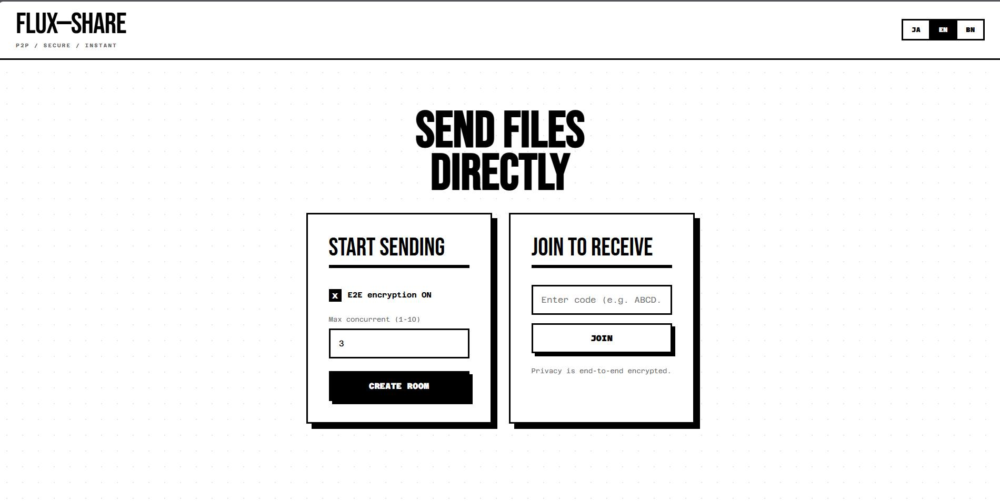

# FluxShare

<div align="center">
  

  <br />
  <br />

  [](https://opensource.org/licenses/MIT)
  [](https://workers.cloudflare.com/)
  [](https://hono.dev/)
  [](https://www.typescriptlang.org/)

  <p>
    <b>A secure, serverless peer-to-peer file sharing application.</b>
    <br />
    Transfer files of any size directly between devices. No servers. No limits.
  </p>

  <a href="https://fluxshare.fahadakas-batterylowinteractive.workers.dev"><strong>View Live Demo »</strong></a>
</div>

<br />

## ✨ Features

- 🔒 **End-to-End Encryption**: Files are encrypted using AES-GCM. The key is in the URL and never sent to the server.
- ⚡ **P2P Transfer**: Direct browser-to-browser data transfer via WebRTC for maximum speed.
- ☁️ **Serverless Architecture**: Powered by Cloudflare Workers and Durable Objects.
- 🚀 **No File Size Limits**: Stream files directly between peers without server storage limits.
- 📱 **Cross-Platform**: Works on any modern web browser (Desktop & Mobile).
- 🔗 **Easy Sharing**: Share via link or scan a QR code to join instantly.
- 🏠 **Local Optimization**: Automatically optimizes for local network connections when possible.

## 🛠️ Architecture

FluxShare utilizes a modern, edge-first stack designed for performance and privacy:

- **Signaling Server**: Hosted on **Cloudflare Workers** using [Hono](https://hono.dev/) for high-performance edge routing.
- **State Management**: **Cloudflare Durable Objects** handle room state and WebSocket connections for signaling.
- **Frontend**: Built with **Hono JSX** and **Vite** for fast SSR and lightweight client-side hydration.
- **P2P Layer**: **WebRTC** DataChannels for direct, secure file transmission.

## 🚀 Getting Started

### Prerequisites

- [Node.js](https://nodejs.org/) (v18+ recommended)
- [npm](https://www.npmjs.com/)

### Installation

Clone the repository and install dependencies:

```bash
git clone https://github.com/FahadAkash/Flux_Share.git
cd Flux_Share
npm install
```

### Local Development

Start the local development server:

```bash
npm run dev
```

The application will be available at `http://localhost:5173`.

### Deployment

To deploy to your own Cloudflare account:

1.  Ensure you have [Wrangler](https://developers.cloudflare.com/workers/wrangler/install-and-update/) installed and authenticated.
2.  Run the deploy script:

```bash
npm run deploy
```

> **Note**: The project uses `wrangler.jsonc` for configuration. Update the `name` or `account_id` fields if needed.

## 🤝 Contributing

Contributions are welcome! Please feel free to submit a Pull Request.

## 📄 License

This project is licensed under the MIT License.
